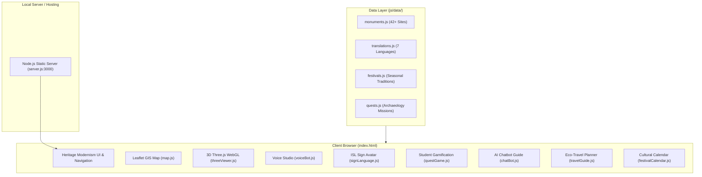

# 🏛️ SanskritiVerse (विरासत) – Complete Project Walkthrough
> **Theme:** Student Innovation – India's Cultural Heritage & Living Traditions  
> **Platform:** Progressive Web Application (WebGL + GIS + Web Speech + Accessibility + Gamification)  
> **Local Server URL:** [http://localhost:3000](http://localhost:3000)

---

## 📑 Table of Contents
1. [Executive Summary & Vision](#-executive-summary--vision)
2. [Technology Stack & Architecture](#-technology-stack--architecture)
3. [Deep-Dive Feature Inventory](#-deep-dive-feature-inventory)
   - [1. 🗺️ Interactive Geospatial Heritage Map](#1-️-interactive-geospatial-heritage-map)
   - [2. 🏛️ 3D Monument Viewer with Historical Time-Travel Slider](#2-️-3d-monument-viewer-with-historical-time-travel-slider)
   - [3. 🎙️ Swar-Virasat: AI Folklore & Voice Studio](#3-️-swar-virasat-ai-folklore--voice-studio)
   - [4. 🤟 Inclusive Indian Sign Language (ISL) Avatar Studio](#4--inclusive-indian-sign-language-isl-avatar-studio)
   - [5. 🎮 Heritage Quest: Student Gamification & Missions](#5--heritage-quest-student-gamification--missions)
   - [6. 🗓️ Cultural Calendar & Seasonal Regional Festivals](#6-️-cultural-calendar--seasonal-regional-festivals)
   - [7. 🌿 Smart & Sustainable Heritage Travel Guide](#7--smart--sustainable-heritage-travel-guide)
   - [8. 🪷 Floating Heritage AI Guide Chatbot](#8--floating-heritage-ai-guide-chatbot)
   - [9. 🌐 7-Language Global Localization Engine](#9--7-language-global-localization-engine)
   - [10. ⚡ Memory & Performance Optimization Architecture](#10--memory--performance-optimization-architecture)
4. [File System & Codebase Directory Mapping](#-file-system--codebase-directory-mapping)
5. [How to Run & Test the Application](#-how-to-run--test-the-application)
6. [Future Expansion & API Integration Roadmap](#-future-expansion--api-integration-roadmap)

---

## 🌟 Executive Summary & Vision

**SanskritiVerse (विरासत)** is a multi-sensory digital platform engineered to preserve, celebrate, and make India’s 5,000-year living cultural heritage engaging for students, researchers, and global explorers. 

Instead of static encyclopedic text, SanskritiVerse integrates **spatial 3D graphics (Three.js)**, **geospatial mapping (Leaflet GIS)**, **browser-native speech synthesis (Web Speech API)**, **interactive Indian Sign Language (ISL) animations for accessibility**, **timed student trivia missions**, and **sustainable travel planning** into a cohesive **"Heritage Modernism"** design system (Royal Navy `#050814`, Temple Gold `#F59E0B`, and Saffron `#EA580C`).

---

## 🛠️ Technology Stack & Architecture

### 1. Frontend & Client-Side Engine
- **Markup & Styling:** HTML5, Modern Responsive Tailwind CSS, Glassmorphism design with backdrop filters, custom HUD styling.
- **3D Graphics & WebGL:** Three.js (r128) with procedural canvas textures, custom architectural mesh builders, dynamic lighting rigs, and memory disposal pipelines.
- **Geospatial GIS:** Leaflet.js with custom glowing saffron temple pin markers, zone filtering, and popup drawer triggers.
- **Audio & Speech:**
  - Native Web Speech API (`window.speechSynthesis`) supporting multilingual narration.
  - Web Audio API synthesizer for procedural UI sound effects (chimes, clicks, laser hums).
  - Canvas 2D live audio resonance frequency visualizer.
- **Accessibility:** 2D Canvas-rendered Indian Sign Language (ISL) avatar with certified hand mudras, dual-language subtitles (English & Hindi), and variable speed controls.
- **Particle Dynamics:** Canvas-based celebratory confetti burst engine for gamification completion.

### 2. Backend & Server Engine
- **Static Server:** Lightweight zero-dependency Node.js HTTP server (`server.js`) with MIME type detection and streaming file responses.
- **Deployment Compatibility:** Firebase Hosting (`firebase.json`, `.firebaserc`) and Google Cloud ready.



---

## 🔍 Deep-Dive Feature Inventory

### 1. 🗺️ Interactive Geospatial Heritage Map
- **Source File:** [map.js](file:///c:/Users/sahith/Desktop/SIH%20PROTOTYPE/js/components/map.js)
- **Data Source:** [monuments.js](file:///c:/Users/sahith/Desktop/SIH%20PROTOTYPE/js/data/monuments.js)
- **Key Capabilities:**
  - Renders interactive parchment/dark cartographic tiles with glowing temple pin markers across India.
  - **Zone Filters:** Filter sites by *All, North, South, East, West, Central, Northeast*.
  - **Slide-Over Monument Drawer:** Clicking a pin opens a detailed side drawer containing historical epoch, ruling dynasty, architectural style, engineering wonders, and oral legends.
  - **Direct Actions:** One-click shortcuts from the drawer to "Explore in 3D", "Listen to Folklore", or "Plan Green Travel".

---

### 2. 🏛️ 3D Monument Viewer with Historical Time-Travel Slider
- **Source File:** [threeViewer.js](file:///c:/Users/sahith/Desktop/SIH%20PROTOTYPE/js/components/threeViewer.js)
- **Architectural Reconstructions:**
  1. **Taj Mahal (Agra):** Symmetrical marble mausoleum, bulbous onion dome, 4 minarets, pishtaq arches, front reflecting water pool.
  2. **Konark Sun Temple (Odisha):** 24-spoked astronomical sundial wheels, tiered Jagamohana hall (Pidha Deula), galloping solar steeds.
  3. **Hampi Stone Chariot (Karnataka):** Monolithic granite Garuda shrine, carved stone wheels, guardian elephants, surrounding musical pillars.
  4. **Great Stupa of Sanchi (Madhya Pradesh):** Hemispherical Anda dome, circumambulatory Vedika balustrade, crowning Harmika, and 4 carved Torana gateways.
- **Historical Time-Travel Slider:**
  - `1000 CE (Origins)`: Ancient sandstone foundations and origin state.
  - `1500 CE (Imperial Peak)`: Pristine marble and gold-leaf ornamentation.
  - `1850 CE (Colonial Transition)`: Weathered stone patina, archaeological surveys.
  - `2026 CE (Modern Conservation)`: UNESCO fiber-optic illumination and modern preservation.
- **Dynamic Lighting Environments:**
  - 🌅 *Golden Hour / Dawn*
  - ☀️ *Midday Radiance*
  - 🌙 *Moonlit Aarti / Night*
- **Memory Management:** Automated GPU buffer cleanup (geometry disposal, texture disposal, material disposal) when changing monuments to prevent WebGL memory leaks.

---

### 3. 🎙️ Swar-Virasat: AI Folklore & Voice Studio
- **Source File:** [voiceBot.js](file:///c:/Users/sahith/Desktop/SIH%20PROTOTYPE/js/components/voiceBot.js)
- **Audio Engine:** Native browser `window.speechSynthesis` with speech rate slider (0.8x to 1.4x), play, pause, resume, and stop controls.
- **Oral Traditions & Regional Legends Included:**
  - *The Sacrifice of Child Architect Dharmapada* (Konark Sun Temple)
  - *The Resonant Mystery of Hampi's Sa-Re-Ga-Ma Musical Pillars* (Vijayanagara)
  - *The Shadowless Vimana of the Great Chola Temple* (Thanjavur)
  - *The City of Light: Shiva's Sacred Kashi Ghats* (Varanasi)
- **Multilingual Support:** Pre-mapped Indian locales (`en-IN`, `hi-IN`, `ta-IN`, `te-IN`, `bn-IN`, `mr-IN`, `gu-IN`) with regional speech synthesis voice detection.
- **Audio Resonance Wave:** Real-time HTML5 Canvas visualizer generating pulsing sine waves synchronized with narrator playback.

---

### 4. 🤟 Inclusive Indian Sign Language (ISL) Avatar Studio
- **Source File:** [signLanguage.js](file:///c:/Users/sahith/Desktop/SIH%20PROTOTYPE/js/components/signLanguage.js)
- **Accessibility Purpose:** Empowers deaf and hard-of-hearing students with visual heritage education.
- **Visual Design:** Distinct high-contrast palette:
  - Body / Kurta: Navy Blue (`#1A237E`)
  - Hands: Distinct Skin Tone (`#F5C6A5`) with outlined fingers for mudra clarity
- **Certified Gestures Implemented:**
  - *Namaste / Welcome* (Anjali Mudra)
  - *Temple / Mandir* (Shikhara roof formation)
  - *Surya / Solar Wheel* (Radiating circular rays)
  - *Sacred River Ganga* (Undulating water flow)
  - *Stone Sculptor / Shilpi* (Mallet and chisel tapping)
  - *Emperor / Rajaraja Chola* (Imperial crown tracing)
- **Features:** Variable playback speed (0.75x, 1.0x, 1.25x), dual subtitles (English & Hindi), play/pause controls.

---

### 5. 🎮 Heritage Quest: Student Gamification & Missions
- **Source File:** [questGame.js](file:///c:/Users/sahith/Desktop/SIH%20PROTOTYPE/js/components/questGame.js)
- **Data Source:** [quests.js](file:///c:/Users/sahith/Desktop/SIH%20PROTOTYPE/js/data/quests.js)
- **Mission Tracks:**
  1. *Secrets of the Chola Dynasty* (Naval expeditions, Dravidian granite engineering)
  2. *Wonders of Western India* (Ajanta murals, subterranean stepwell hydrology)
  3. *Sacred Geometry & Astronomical Marvels* (Konark solar clock, Hampi acoustic resonance)
- **Gamification Mechanics:**
  - Timed multiple-choice trivia with immediate audio feedback (synthesized success chime or buzz).
  - Detailed archaeological explanations revealed upon submission.
  - XP progression, 3-day streak counter, and rank progression:
    *Heritage Scout → Cultural Chronicler → Virasat Custodian → Virasat Grand Guardian*.
  - Celebratory full-screen confetti particle burst on quest completion.

---

### 6. 🗓️ Cultural Calendar & Seasonal Regional Festivals
- **Source File:** [festivalCalendar.js](file:///c:/Users/sahith/Desktop/SIH%20PROTOTYPE/js/components/festivalCalendar.js)
- **Data Source:** [festivals.js](file:///c:/Users/sahith/Desktop/SIH%20PROTOTYPE/js/data/festivals.js)
- **Festivals Covered:** Pongal & Makar Sankranti, Rongali Bihu, Onam, Durga Puja, Hornbill Festival, Chhath Puja, Pushkar Camel Fair, Dev Deepawali.
- **Filter Categories:** *All, Harvest, Vernal / Spring, Sacred Pilgrimages, Folk & Arts*.
- **Interactive Popup Modals:** Detailed cultural deep-dives into astronomical timing, mythological origins, sacred rituals, festive culinary delicacies, and folk performance arts.

---

### 7. 🌿 Smart & Sustainable Heritage Travel Guide
- **Source File:** [travelGuide.js](file:///c:/Users/sahith/Desktop/SIH%20PROTOTYPE/js/components/travelGuide.js)
- **Eco-Conscious Tourism Focus:**
  - Dynamic selector for all major heritage sites.
  - Optimal visiting months and climate recommendations.
  - Transit connectivity (nearest airports, high-speed rail junctions).
  - **Green Eco-Transit:** Battery-operated shuttles, rental bicycle trails, heritage walking tours.
  - **GI-Tagged Artisanal Handlooms & Crafts:** (e.g., Patan Patola, Thanjavur bronze, Banarasi silk) to directly support local artisan economies.
  - Local heritage gastronomy recommendations.

---

### 8. 🪷 Floating Heritage AI Guide Chatbot
- **Source File:** [chatBot.js](file:///c:/Users/sahith/Desktop/SIH%20PROTOTYPE/js/components/chatBot.js)
- **Design:** Floating launcher button with pulsing halo badge and expandable glassmorphic chat window.
- **Knowledge Base:** Curated domain rules covering ancient dynasties (Maurya, Gupta, Chola, Vijayanagara, Mughal), classical architecture orders (Nagara, Dravidian, Vesara), stone carving methods, and conservation ethics.
- **Accessibility:** Built-in **"Listen to Answer"** text-to-speech button attached to every AI response.
- **Quick Prompts:** One-click sample questions for instant answers.

---

### 9. 🌐 7-Language Global Localization Engine
- **Source File:** [translations.js](file:///c:/Users/sahith/Desktop/SIH%20PROTOTYPE/js/data/translations.js)
- **Supported Languages:**
  1. English (`en`)
  2. हिन्दी - Hindi (`hi`)
  3. தமிழ் - Tamil (`ta`)
  4. తెలుగు - Telugu (`te`)
  5. বাংলা - Bengali (`bn`)
  6. मराठी - Marathi (`mr`)
  7. ગુજરાતી - Gujarati (`gu`)
- **Implementation:** Attribute-based DOM localization (`data-i18n="key"`), enabling instantaneous switching without page reloads.

---

### 10. ⚡ Memory & Performance Optimization Architecture
- **Low-Memory Device Detection:** Checks `navigator.deviceMemory` (if available) and clamps WebGL pixel ratio to 1.0 or 1.5 on low-spec hardware.
- **Procedural Canvas Textures:** Textures (marble, sandstone, pietra dura) generated at lightweight 256×256 resolutions.
- **GPU Resource Disposal:** Explicit traversal calls to `.dispose()` on all geometry and material buffers when switching 3D monuments.
- **Visibility API:** Detects tab switching via `document.visibilitychange` to suspend animation loops when the user navigates away.

---

## 📁 File System & Codebase Directory Mapping

```
c:\Users\sahith\Desktop\SIH PROTOTYPE\
├── index.html                   # Master single-page application layout
├── server.js                    # Zero-dependency Node.js HTTP server (port 3000)
├── README.md                    # Project overview & pitch notes
├── PROJECT_WALKTHROUGH.md       # Downloadable markdown guide
├── PROJECT_WALKTHROUGH.html     # Downloadable presentation-ready HTML/PDF format
├── firebase.json                # Firebase hosting configuration
├── css/
│   └── styles.css               # Heritage Modernism theme, animations, glass panels
└── js/
    ├── app.js                   # Application coordinator & event dispatcher
    ├── components/
    │   ├── map.js               # Leaflet GIS cartography & monument markers
    │   ├── threeViewer.js       # Three.js 3D monument viewer & time-travel slider
    │   ├── voiceBot.js          # Web Speech API folklore narration & audio wave
    │   ├── signLanguage.js      # 2D ISL sign language avatar studio
    │   ├── questGame.js         # Student gamified quests, XP & badges
    │   ├── festivalCalendar.js  # Regional festival explorer & modal dialogs
    │   ├── travelGuide.js       # Eco-friendly heritage travel planner
    │   └── chatBot.js           # Floating Heritage AI chatbot guide
    ├── data/
    │   ├── monuments.js         # Detailed metadata for 42+ monuments
    │   ├── translations.js      # 7-language translation dictionary
    │   ├── festivals.js         # Cultural festival calendar database
    │   ├── quests.js            # Curated archaeological trivia missions
    │   └── visionPresets.js     # Artifact recognition benchmark presets
    └── utils/
        ├── audioEffects.js      # Web Audio API procedural UI sound synthesizer
        └── confetti.js          # Full-screen particle celebratory burst engine
```

---

## 🚀 How to Run & Test the Application

### 1. Starting the Local Web Server
Ensure Node.js is installed, then open PowerShell in the project directory:
```powershell
cd "c:\Users\sahith\Desktop\SIH PROTOTYPE"
node server.js
```
The server will bind to `http://localhost:3000`.

### 2. Viewing the Application
Open any modern web browser and navigate to:
```
http://localhost:3000
```

### 3. Recommended Judge / Evaluator Flow
1. **Explore the Map:** Click on temple pins (e.g., Konark, Thanjavur, Taj Mahal) and open the slide-over drawer.
2. **Interact with 3D Models:** Scroll down to the 3D Viewer, rotate the monument, drag the **Time-Travel Slider** from 1000 CE to 2026 CE, and switch lighting from Dawn to Moonlit Aarti.
3. **Listen to Swar-Virasat:** Pick a story (e.g., *Dharmapada* or *Hampi Musical Pillars*), choose a language, and click **Narrate Story**.
4. **Test ISL Sign Language:** Select phrases like *Mandir* or *Surya* and observe the navy/skin-tone avatar gestures.
5. **Play Heritage Quest:** Complete a mission trivia, earn XP, and trigger the celebratory confetti.
6. **Switch Languages:** Use the header dropdown to toggle between English, Hindi, Tamil, Telugu, Bengali, Marathi, and Gujarati.
